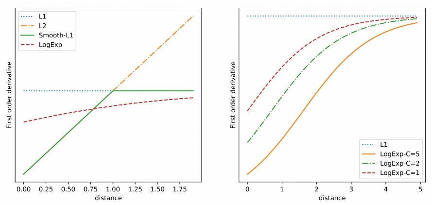

# AAAI2023 Workshop | Dive into the Resolution Augmentations and Metrics in Low Resolution Face Recognition: A Plain yet Effective New Baseline

This repository contains the official Pytorch implementation of the paper "Dive into the Resolution Augmentations and Metrics in Low Resolution Face Recognition: A Plain yet Effective New Baseline"

## Network Architecture

In order to dig deeper into the potential of resolution and constraint functions, we used the most concise network structure as follow.

## The Impact of Different Resolutions

## The $LogExp$ Function

We propose the $LogExp$ Function to replace the commonly used $L_1$ or $L_2$ loss, which incorporates the advantages of both based on the analysis of their merits.

$$L_{Log⁡Exp}=\frac{1}{p\cdot D}log⁡(1+\sum_{i=1}^D( e^{(|x_i-y_i|)^p} -1)). $$

# Citation